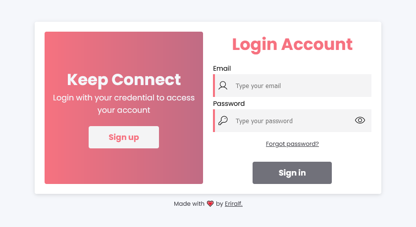

# Form Page

Este projeto foi desenvolvido para aplicar conhecimentos em HTML, CSS e JS, com o objetivo de criar um formulário responsivo com três páginas distintas: Login, Registro e Recuperação de Senha.

O formulário permite ao usuário criar uma conta, fazer login e recuperar a senha em caso de esquecimento. Cada página contém campos específicos para cada ação, como nome de usuário, senha e e-mail. A interface foi criada com um design intuitivo e de fácil utilização.

O JavaScript foi utilizado para verificar os campos e garantir que eles sejam preenchidos corretamente. Isso significa que o usuário não conseguirá enviar o formulário se houver campos vazios ou preenchidos de forma inválida.

A implementação da responsividade foi uma das principais preocupações deste projeto, garantindo que o formulário seja facilmente acessível em diferentes tamanhos de tela, desde dispositivos móveis até desktops.

## 🚀 Tecnologias utilizadas

- HTML e CSS
- JavaScript
- Git e Github

[💻 Live Preview](https://ralpform.netlify.app/)

## 🛠️ Melhorias

- [ ] Melhorias visuais
- [ ] Validação do formulário
- [ ] Adicionar campos dependentes

---
Made with &#128151; by [Eriralf Barros.](https://www.linkedin.com/in/eriralfbarros/)

